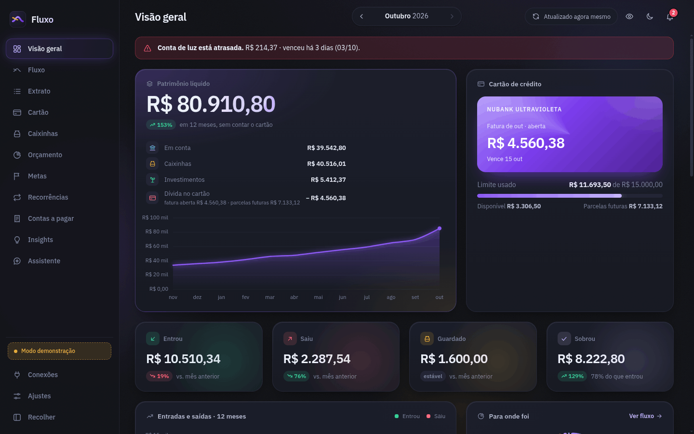
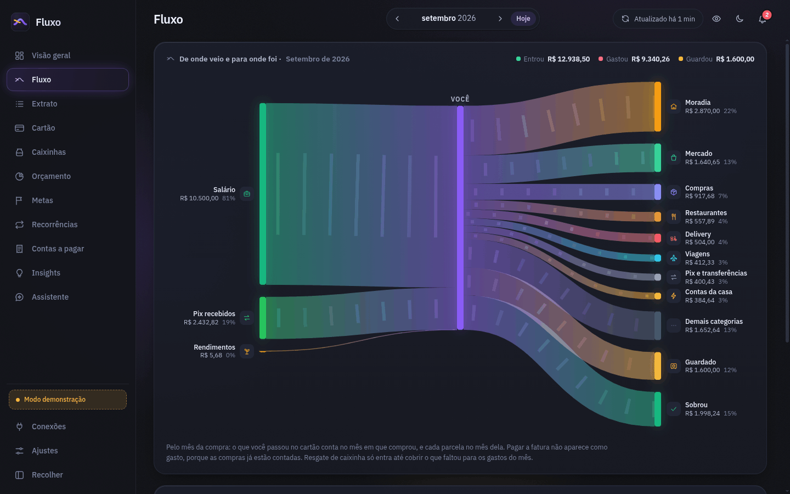
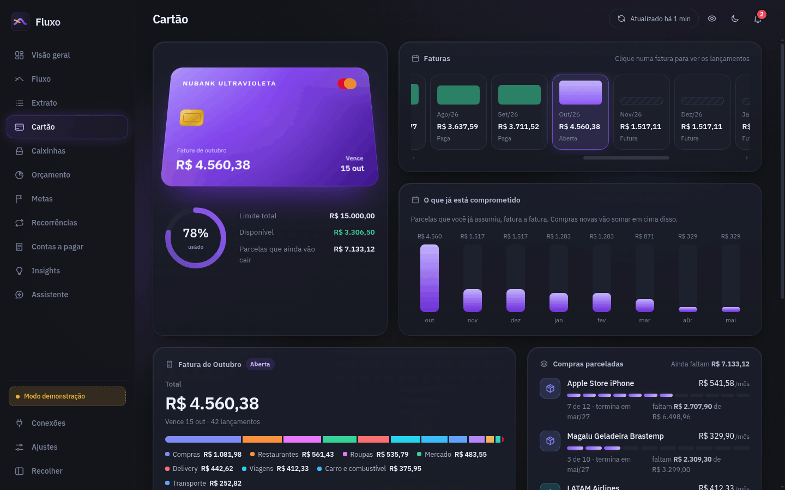
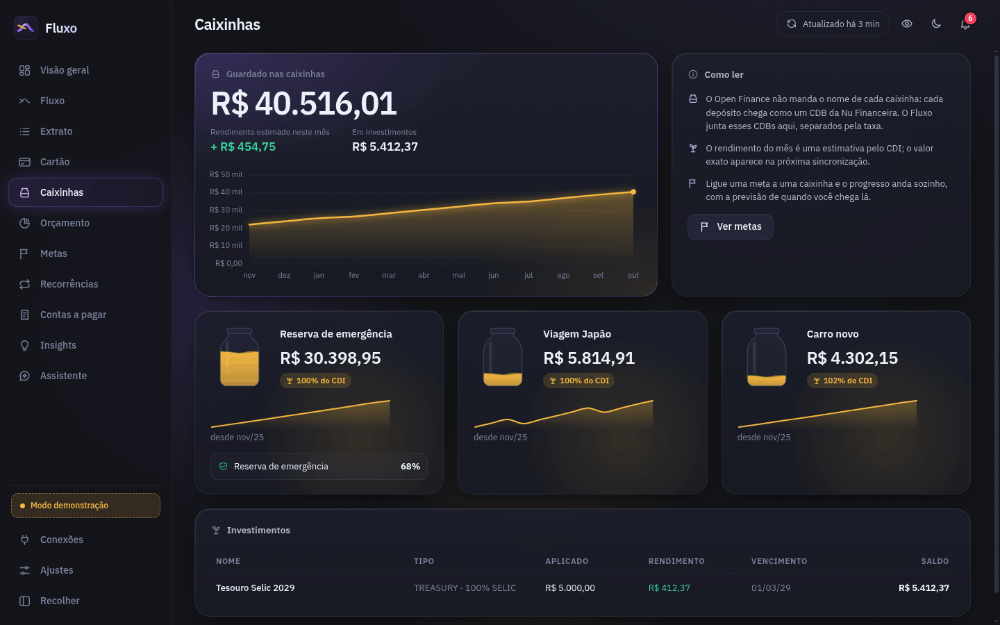
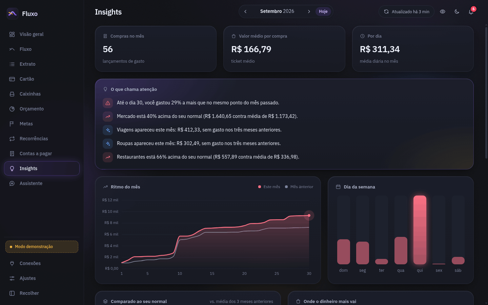
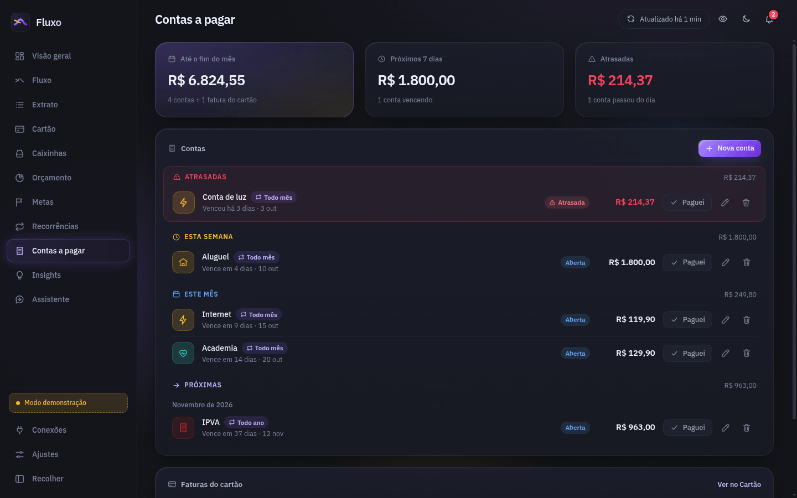
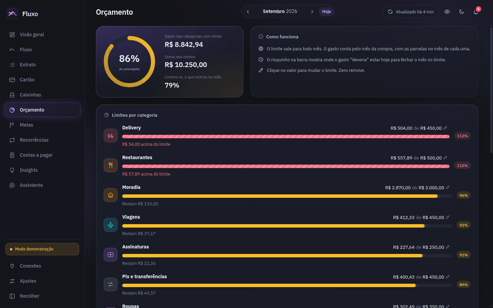
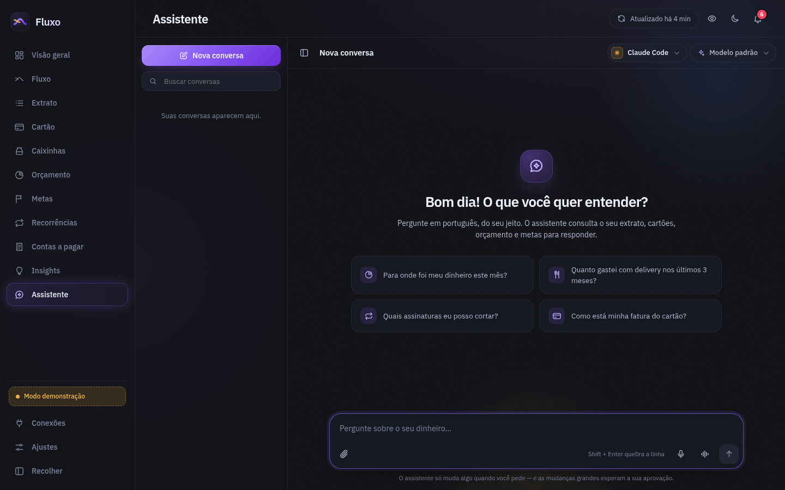
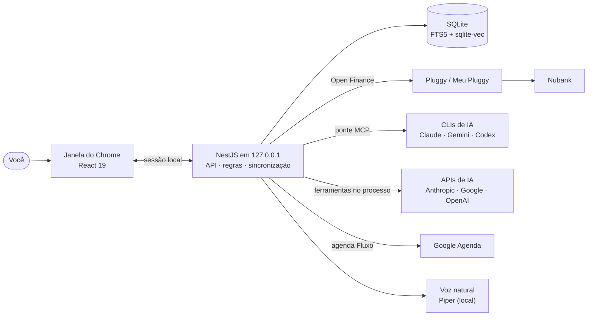

<div align="center">


# Fluxo

**Suas finanças do Nubank, no seu computador — com um assistente que conhece cada centavo.**
Conta, cartão, faturas, parcelas, caixinhas, orçamento, metas e contas a pagar, num app que roda
só em `127.0.0.1` e conversa com a IA que você já paga.

[](https://github.com/eduardorarruda/fluxo-assistente-financeiro/actions/workflows/ci.yml)
[](LICENSE)
[](.nvmrc)
[](web)
[](server)
[](#-privacidade)

[Início rápido](#-início-rápido) ·
[Recursos](#-o-que-ele-faz) ·
[Assistente](#-um-assistente-que-conhece-o-seu-dinheiro) ·
[Arquitetura](#-arquitetura) ·
[Contribuir](CONTRIBUTING.md)



</div>

---

## ✨ Por que o Fluxo

- **Tudo no seu computador.** Um processo só, ouvindo em `127.0.0.1`, e um arquivo SQLite. Sem
  nuvem, sem conta para criar, sem servidor de ninguém no meio.
- **O número certo.** Nada conta duas vezes: pagar a fatura, guardar na caixinha e mandar Pix para
  outra conta sua não são gasto. Cada parcela conta no mês dela, e o Pix no crédito é reconhecido
  pelo par na conta — não pelo texto da loja.
- **Um assistente com a IA que você já paga.** Usa o CLI do seu plano (Claude Code, Gemini CLI,
  Codex) ou uma chave de API. Lê seus números pelas ferramentas do Fluxo e também age — sempre com
  a sua aprovação para o que é grande.
- **Voz natural, sem sair da máquina.** Dite, converse por voz e ouça as respostas com vozes
  Piper rodando localmente.
- **Contas a pagar que se dão baixa sozinhas.** Quando o pagamento aparece no extrato, a conta é
  marcada como paga; faturas e vencimentos podem ir para o Google Agenda e avisar no celular.

## 🚀 Início rápido

Você precisa de **Linux**, **Node.js 24** (veja [`.nvmrc`](.nvmrc); o mínimo é o 22) e **Chrome ou
Chromium** para a janela do app.

```bash
git clone https://github.com/eduardorarruda/fluxo-assistente-financeiro.git
cd fluxo-assistente-financeiro
npm install
npm run build
./fluxo.sh
```

Sem credenciais, o Fluxo abre no **modo demonstração**: um Nubank fictício com 14 meses de
histórico, para ver tudo funcionando. Ele sai sozinho quando você conecta o banco de verdade.

Para ler o seu Nubank pelo Open Finance, crie uma aplicação na Pluggy (o **Meu Pluggy** é gratuito
para uso pessoal) e preencha as credenciais:

```bash
cp .env.exemplo .env && chmod 600 .env   # PLUGGY_CLIENT_ID e PLUGGY_CLIENT_SECRET
scripts/instalar-atalho.sh               # opcional: "Fluxo" no menu de aplicativos
```

> **Atenção ao prazo do Meu Pluggy:** só dá para conectar bancos durante os 15 dias de teste da
> conta de desenvolvedor. O passo a passo, com as armadilhas, está no [manual](LEIA-ME.md#conectar-o-nubank-uns-10-minutos).

| Comando | O que faz |
|---|---|
| `./fluxo.sh` | Sobe o servidor e abre a janela própria (Chrome em modo app) |
| `./fluxo.sh --navegador` | Abre numa aba do navegador padrão |
| `./fluxo.sh --servidor` | Só o servidor, sem janela (Ctrl+C para parar) |
| `FLUXO_PORTA=8790 ./fluxo.sh` | Usa outra porta local (padrão `8778`) |

Fechou a janela, o servidor percebe em até 90 s e desliga sozinho. O manual completo — Pluggy,
assistente, voz, Google Agenda e atalhos — está em [LEIA-ME.md](LEIA-ME.md).

## 🧭 O que ele faz

<table>
<tr>
<td width="50%" valign="top">

**Entender**
- Visão geral com patrimônio líquido em 12 meses: conta, caixinhas, investimentos e cartão
- **Fluxo** em Sankey — de onde veio e para onde foi — e o caixa da conta à parte
- Extrato com busca por loja, pessoa, nota ou valor; edite categoria e nota ou ignore um lançamento
- Cartão: faturas passadas e futuras, parcelas comprometidas e compras parceladas
- Insights: ritmo do mês, dia da semana e o que fugiu do seu normal

**Planejar**
- Orçamento por categoria, com limites sugeridos pela média dos últimos três meses
- Metas ligadas a uma caixinha, com a previsão de quando você chega lá
- Caixinhas e investimentos, com o rendimento estimado do mês
- Assinaturas e recorrências: custo anual e aviso de aumento

</td>
<td width="50%" valign="top">

**Conversar**
- Chat com Claude, Gemini ou ChatGPT — pelo CLI do seu plano ou por chave de API
- 34 ferramentas: resumo do mês, busca no extrato, faturas, orçamento, metas, contas a pagar…
- Anexos (imagens, PDF, CSV) com o texto extraído e buscável; busca por significado local
- Imagens geradas (Nano Banana, via Gemini) presas à conversa, só quando você pede
- Voz: ditado, conversa por voz e respostas faladas com vozes naturais locais (Piper)

**Automatizar**
- Sincronização com o Nubank pela Pluggy a cada hora, com o app aberto
- Contas a pagar que se conciliam com o extrato e dão baixa sozinhas
- Alertas: conta atrasada, orçamento estourando, fatura vencendo, conexão com problema
- Google Agenda: faturas e contas numa agenda própria, "Fluxo", com aviso no celular
- Regras de categoria — "sempre que aparecer…" — aplicadas no passado e no futuro

</td>
</tr>
</table>

<p align="center">
  
  
</p>
<p align="center">
  
  
</p>
<p align="center">
  
  
</p>

## 🤖 Um assistente que conhece o seu dinheiro

Pergunte "para onde foi meu dinheiro este mês?" e a resposta vem dos **seus** números, conferidos
pelas mesmas regras das telas. Mas um assistente que lê descrições de Pix e anexos lê texto escrito
por terceiros — por isso cada porta tem uma tranca:

| O quê | O que é garantido |
|---|---|
| **Acesso aos dados** | Só pelas ferramentas do Fluxo: pela ponte MCP, no caso do CLI, ou dentro do próprio servidor, no caso da API. O token da ponte vale só para as ferramentas e morre no fim da resposta |
| **CLI travado** | Sem terminal, sem escrever arquivos, sem web (`--restricted` no Claude, políticas restritivas no Gemini e no Codex). Nunca `--yolo` nem *bypass* de permissões |
| **Chaves de API** | Em arquivos `0600`, nunca no banco, no log, numa resposta da API ou no ambiente do CLI — a tela mostra só o final (`…AbCd`) |
| **Ações pequenas** | Ajustar um lançamento, criar ou editar uma conta a pagar, marcar como paga: na hora, até 10 por resposta, **sempre com Desfazer** |
| **Ações grandes** | Regras de categoria, recategorizar em massa, orçamento, metas, remover conta: viram **proposta** com o efeito exato (a regra é simulada nos seus lançamentos e mostra quantos muda) e esperam o seu **Aprovar** |
| **Texto de terceiros** | Descrição de Pix e anexos nunca aprovam nada. Pelo chat, só vale a confirmação escrita por você, logo depois de ver a proposta |
| **Execução** | Tudo é revalidado e roda numa transação SQLite com o seu registro: clique duplo faz uma vez, e nada é desfeito por cima de uma mudança sua mais nova |
| **Imagens** | `gerar_imagem` só roda quando a sua própria mensagem pede uma imagem — texto de terceiros não gasta a sua chave |

<p align="center">
  
</p>

A especificação completa — CLIs, ponte MCP, ferramentas, propostas, busca e voz — está em
[docs/ASSISTENTE.md](docs/ASSISTENTE.md).

## 🏗️ Arquitetura



As setas para fora só existem se você configurar o serviço; sem nada configurado, o Fluxo roda
no modo demonstração e não sai da máquina.

| Pasta | Papel |
|---|---|
| [`server/src/domain/`](server/src/domain) | As regras de dinheiro: classificação, competência, cartão, orçamento, metas, Sankey — funções puras e testadas |
| [`server/src/provedores/`](server/src/provedores) | Pluggy (real) e demonstração, no mesmo formato |
| [`server/src/dados/`](server/src/dados) | SQLite: leitura, sincronização sem apagar edições e as edições da pessoa |
| [`server/src/servicos/`](server/src/servicos) | Cada tela montada a partir do domínio; contas a pagar e conciliação |
| [`server/src/http/`](server/src/http) | API, validação, sessão local e segurança (Host, Origin, cabeçalhos) |
| [`server/src/assistente/`](server/src/assistente) | O chat: CLIs travados, ponte MCP, ferramentas, ações, anexos, busca (RAG), imagens e voz |
| [`server/src/google/`](server/src/google) | Google Agenda: OAuth com PKCE, cofre do token e sincronia de eventos |
| [`web/src/paginas/`](web/src/paginas) | As telas: Visão geral, Fluxo, Extrato, Cartão, Caixinhas, Orçamento, Metas, Assistente… |
| [`web/src/graficos/`](web/src/graficos) | Sankey, área, barras, rosca e pote — SVG com animação |
| [`web/src/componentes/`](web/src/componentes) | Navegação, topo, campos de dinheiro e data, avisos |
| [`docs/`](docs) | Decisões de projeto, assistente, contas a pagar e Google Agenda |

## ✅ Como sabemos que funciona

**1.226 testes passando** — 869 no servidor (Vitest + Supertest, com integração de ponta a ponta
da API) e 357 na interface (Vitest + React Testing Library). As regras de dinheiro são funções
puras em [`server/src/domain/`](server/src/domain), cada uma com a sua bateria; nenhum teste usa
dado real nem chama a Pluggy, o Google ou um provedor de IA de verdade.

Os testes não bastam para um app de dinheiro, então o Fluxo também foi conferido contra uma conta
real do Nubank: **601 de 601** compras do cartão caíram na fatura certa (pelo `billId` do banco), e
o resumo do mês devolvido pelas ferramentas do assistente bate **com a tela, centavo por centavo**.

## 🔒 Privacidade

**Fica no seu computador:** o banco (`data/fluxo.db`), as conversas e os anexos, a sessão, as
chaves de API e o token do Google — tudo em `data/`, com arquivos `0600` (só você lê). Backup é
copiar o arquivo. O servidor só aceita `127.0.0.1`, e toda a API exige a sessão local (código de uso
único → cookie `HttpOnly`/`SameSite=Strict`): nenhum outro programa nem site consegue chamá-lo.

**Só sai se você configurar:**

- **Pluggy** — a sincronização com o banco. O segredo fica no servidor; o navegador recebe só um
  token de 30 minutos para conectar. O Fluxo nunca vê a senha do banco e nunca movimenta dinheiro.
- **Provedor de IA** (Anthropic, Google ou OpenAI, pelo CLI ou pela API) — as suas perguntas e os
  dados que o assistente consulta para responder, nas regras da sua conta lá.
- **Google Agenda** — os eventos de vencimento, apenas na agenda "Fluxo" (escopo
  `calendar.app.created`).
- **Gemini (Nano Banana)** — a descrição das imagens que você pedir.
- **Reconhecimento de voz "Pelo Google"** — o áudio do ditado e da conversa por voz. No modo
  "No computador", nada sai; as vozes naturais (Piper) também rodam localmente.

## 🧑‍💻 Desenvolvimento

```bash
npm run dev                                  # NestJS (watch) + Vite; o token de dev vem de data/.sessao
npm test                                     # servidor (Vitest + Supertest) e interface (Vitest + RTL)
npm run typecheck                            # tipos do servidor e da interface
cd server && npx vitest run src/domain       # só as regras de dinheiro
npm run build && ./fluxo.sh --servidor       # caminho de produção, sem janela
```

Convenções (dinheiro sempre em centavos, datas `AAAA-MM-DD`, identificadores em português) estão em
[CONTRIBUTING.md](CONTRIBUTING.md); as decisões de projeto, em [docs/](docs).

## 🤝 Contribuindo

Issues e pull requests são bem-vindos — leia o [guia de contribuição](CONTRIBUTING.md) e o
[código de conduta](CODE_OF_CONDUCT.md). Vulnerabilidades: [SECURITY.md](SECURITY.md), nunca em
issue pública.

## 📄 Licença

[MIT](LICENSE). Use, estude, modifique e distribua à vontade — só mantenha o aviso de copyright.

> **Aviso:** o Fluxo não é afiliado a Nubank, Pluggy, Google, Anthropic ou OpenAI. Não é
> aconselhamento financeiro: é uma ferramenta para acompanhar as suas próprias finanças.

<details>
<summary><b>English summary</b></summary>

Fluxo is a self-hosted personal finance app that runs entirely on your own machine (`127.0.0.1`,
one SQLite file) and reads Nubank through Open Finance via Pluggy: account, credit card, bills,
installments, savings boxes, budgets, goals, subscriptions and bills to pay. Its money rules are
pure, tested functions — nothing is counted twice, and each installment lands in its own month.
A built-in assistant talks about your numbers using the AI you already pay for (Claude Code, Gemini
CLI or Codex CLI, or an API key), reaching your data only through Fluxo's tools; small changes run
at once and can be undone, larger ones wait for your approval, and third-party text can never
approve anything. It also offers local natural voices (Piper) and Google Calendar reminders. Without
credentials it starts in demo mode: `npm install && npm run build && ./fluxo.sh`. The codebase and
UI are in Brazilian Portuguese. Licensed under MIT.

</details>
